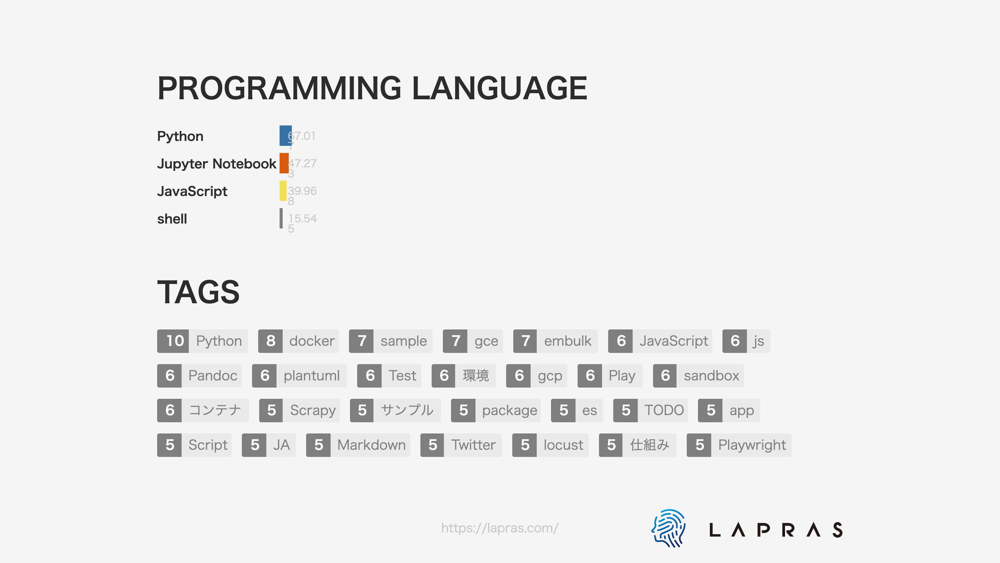

### Hi there 👋

- 得意な順
  - クラウドインフラ > バックエンド開発 > フロント開発 > 機械学習
- Qiita
   - https://qiita.com/nassy20
- 運営サービス
   - https://media2txt.com/

# おすすめrepo :rainbow:

- 会社でPythonを教えています
    - https://github.com/nnashiki/python_workshop
- Pthon製CLIをパッケージングしてみた
    - https://github.com/nnashiki/wordcloud-cli
- PythonパッケージをPyPIに登録してみた
    - https://github.com/nnashiki/play_py37_package
- AirflowをGCPで運用する構成
    - https://github.com/nnashiki/airflow_on_gcp_freeze1
- Pandoc + eisvogel で日本語を含む Markdown から PDF 出力できる Dokcer コンテナ
    - https://github.com/nnashiki/pandoc-eisvogel-ja
- PlantUML の Docker コンテナ実行環境
    - https://github.com/nnashiki/plantuml-docker

# 技術

## 技術スタック一覧

- Python3, FastAPI, Django
- js(ES6), TypeScript
- GCP(GCE, BigQuery, AppEngine, AutoMLTables, Composer(Airflow), Dataflow, モニタリング, pubsub, Vision)
- Azure(ARMTemplates, VM, Vnet,  WAF)
- AWS(S3)
- CI(CircleCI, Cloud build, GitHub Actions, Azure PipeLines)
- インフラ
  - Docker, Docker Compose, Packer, Terraform, Ansible
- データ
  - Airflow, Embulk
- Jupyter
- PlantUML

# 得意な事 

- webアプリケーション開発
- Packer, Terraform, Docker を活用してコード化されたインフラ構築ができる
- 運用・監視設計
- スケールアウトを考慮したシステム開発設計ができること
- サーバーリソースを効率的に使う設計ができる
- 得意言語(Python) 以外でも Docker コンテナを作ってツール活用できる(Java, Haskell)
- 複雑な SQL、効率的な SQL が書ける
- 担当者がいなくなり保守不能になったサービスを何度も立て直してきた

# 詳しくはないがやっていること
- フロントエンド開発
- DDD・クリーンアーキテクチャー
- データサイエンティストに指示をもらいながら、データ加工・モデルの作成・モデルの評価・実験デザインができること

# 苦手なこと

- 機械学習や統計知識はあまりないです

# やった事が無いこと

- 大規模なアプリケーションサーバー開発

<!--
**nnashiki/nnashiki** is a ✨ _special_ ✨ repository because its `README.md` (this file) appears on your GitHub profile.

Here are some ideas to get you started:

- 🔭 I’m currently working on ...
- 🌱 I’m currently learning ...
- 👯 I’m looking to collaborate on ...
- 🤔 I’m looking for help with ...
- 💬 Ask me about ...
- 📫 How to reach me: ...
- 😄 Pronouns: ...
- ⚡ Fun fact: ...
-->
